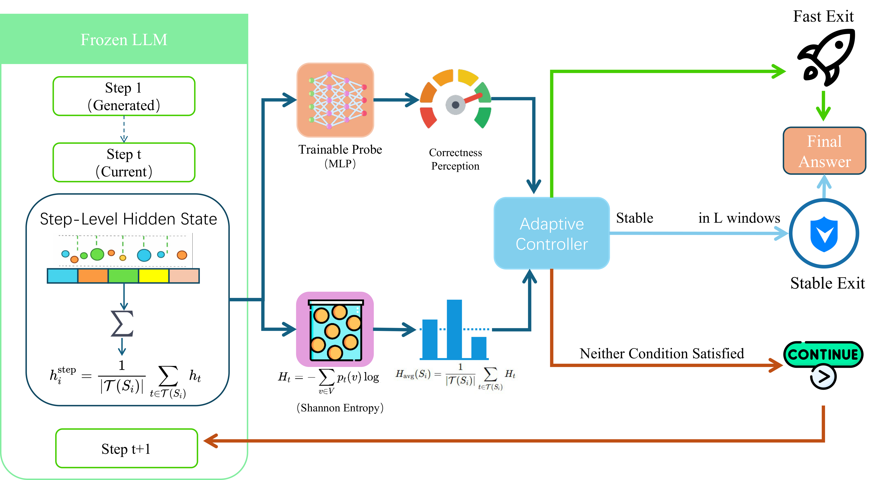

# Shortcut Decoding

A plug-and-play framework for accelerating Chain-of-Thought (CoT) reasoning in Large Reasoning Models (LRMs) without any fine-tuning of the base model.

## Overview

Recent LRMs such as OpenAI-o1 and DeepSeek-R1 scale test-time compute to achieve strong reasoning performance, but they frequently *overthink* — generating redundant verification and digressions long after the answer is internally resolved. This leads to substantial computational cost with negligible accuracy gains.

Our framework is grounded in a simple empirical observation: LLMs *think faster than they speak*. The high-dimensional internal representation often converges to the correct answer well before the textual CoT concludes. Motivated by this misalignment between internal belief saturation and external realization, **Shortcut Decoding** detects such convergence during generation and switches directly to final-answer production, skipping the remaining redundant steps.

## Key Ideas

- **Empirical validation of "thinking faster than speaking".** We show that the internal hidden states of LLMs offer predictive signals for final correctness significantly earlier than explicit CoT completion, providing a foundation for hidden-state-based early stopping.
- **Dual-signal early-exit framework.** At each reasoning step we collect two complementary signals on top of a *frozen* reasoning model:
  - an **internal confidence score** from a lightweight MLP probe over the step's hidden state, and
  - an **external uncertainty score** from the step-averaged next-token entropy.
- **Adaptive controller.** The controller jointly evaluates the two signals at every step boundary and chooses one of three actions:
  - **Fast exit** — probe score is very high *or* entropy is extremely low (strong convergence).
  - **Stable exit** — probe score is high but entropy is only moderate; the signals must remain consistent over consecutive steps before exiting.
  - **Continue** — otherwise, keep generating CoT.
- **Training-free & model-preserving.** The controller acts as an external observer at step boundaries and leaves the base model untouched, so it is complementary to system-level optimizations (FlashAttention, speculative decoding, etc.) and RL-based length control.

## Results

Across multiple mathematical reasoning benchmarks, Shortcut Decoding:

- reduces token usage by **~35%**,
- maintains final-answer accuracy comparable to the full CoT baseline, and
- outperforms existing dynamic early-stopping baselines (e.g., *Dynamic Early Exit*, *Escape Sky-high Cost*) without any fine-tuning of the base model.

## Code & Resources

Coming soon — code, probes, and evaluation scripts will be released here shortly. Stay tuned!
